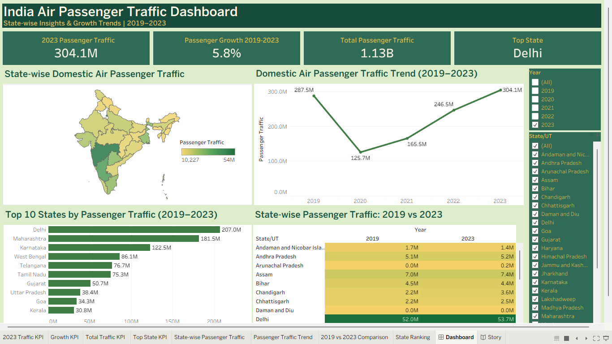
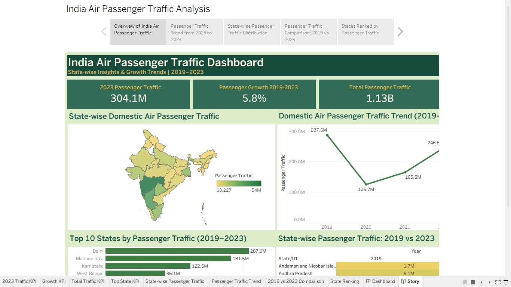

# ✈️ India Air Passenger Traffic Analysis – Tableau

## 📌 Project Overview

This project analyzes India's domestic air passenger traffic from **2019 to 2023** using Tableau.

The dashboard provides a state-wise view of passenger traffic, overall growth trends, top-performing states, geographic distribution, and a comparison between 2019 and 2023. An interactive Tableau Story was also created to present the analysis in a structured sequence.

---

## 🎯 Project Objective

The main objectives of this project are to:

- Analyze domestic air passenger traffic across Indian States and Union Territories.
- Examine passenger traffic trends from 2019 to 2023.
- Identify states with the highest passenger traffic.
- Compare passenger traffic between 2019 and 2023.
- Visualize the geographic distribution of passenger traffic across India.
- Create an interactive dashboard and story for clear presentation of insights.

---

## 📊 Dashboard KPIs

| KPI | Value |
|---|---:|
| 2023 Passenger Traffic | 304.1M |
| Passenger Growth (2019–2023) | 5.8% |
| Total Passenger Traffic | 1.13B |
| Top State | Delhi |

---

## 📈 Passenger Traffic Trend

The dashboard highlights the impact and subsequent recovery of domestic air passenger traffic across the five-year period.

| Year | Passenger Traffic |
|---|---:|
| 2019 | 287.5M |
| 2020 | 125.7M |
| 2021 | 165.5M |
| 2022 | 246.5M |
| 2023 | 304.1M |

Passenger traffic declined sharply in 2020, followed by consistent recovery from 2021 onward. By 2023, passenger traffic had exceeded the 2019 level.

---

## 🗺️ Dashboard Visualizations

The Tableau dashboard includes:

- **KPI Cards** – 2023 passenger traffic, growth, total passenger traffic, and top state
- **Filled Map** – State-wise domestic air passenger traffic across India
- **Line Chart** – Passenger traffic trend from 2019 to 2023
- **Top 10 States Bar Chart** – Ranking of states by passenger traffic
- **Highlight Table** – State-wise comparison of passenger traffic between 2019 and 2023
- **Year Filter** – Interactive analysis by year
- **State/UT Filter** – Interactive analysis by individual State or Union Territory

---

## 🏆 Top States by Passenger Traffic

Across the 2019–2023 period, the leading states shown in the dashboard include:

| Rank | State | Passenger Traffic |
|---:|---|---:|
| 1 | Delhi | 207.0M |
| 2 | Maharashtra | 181.5M |
| 3 | Karnataka | 122.5M |
| 4 | West Bengal | 86.1M |
| 5 | Telangana | 76.7M |
| 6 | Tamil Nadu | 75.3M |
| 7 | Gujarat | 50.7M |
| 8 | Uttar Pradesh | 38.4M |
| 9 | Goa | 34.3M |
| 10 | Kerala | 30.8M |

---

## 💡 Key Insights

- Total passenger traffic across the analyzed period reached approximately **1.13 billion**.
- Passenger traffic fell from **287.5M in 2019 to 125.7M in 2020**, representing the most significant decline in the period.
- Traffic recovered progressively to **165.5M in 2021**, **246.5M in 2022**, and **304.1M in 2023**.
- 2023 passenger traffic was approximately **5.8% higher than 2019**, indicating recovery beyond the pre-2020 level.
- **Delhi** recorded the highest cumulative passenger traffic in the dashboard at approximately **207.0M**.
- Maharashtra and Karnataka were also among the major contributors to domestic passenger traffic.
- Passenger traffic varies considerably across States and Union Territories, which is clearly visible through the geographic analysis.

---

## 📖 Tableau Story

In addition to the main dashboard, a Tableau Story was created to present the analysis through multiple stages:

1. Overview of India Air Passenger Traffic
2. Passenger Traffic Trend from 2019 to 2023
3. State-wise Passenger Traffic Distribution
4. Passenger Traffic Comparison: 2019 vs 2023
5. States Ranked by Passenger Traffic

### Story Preview

---

## 📑 Tableau Workbook Structure

The workbook contains dedicated worksheets for:

- `2023 Traffic KPI`
- `Growth KPI`
- `Total Traffic KPI`
- `Top State KPI`
- `State-wise Passenger Traffic`
- `Passenger Traffic Trend`
- `2019 vs 2023 Comparison`
- `State Ranking`

These worksheets are combined into the final interactive dashboard and Tableau Story.

---

## 🛠️ Tools & Technologies

- **Tableau**
- **Data Visualization**
- **Dashboard Design**
- **Interactive Filters**
- **Geographic Analysis**
- **Data Storytelling**
- **CSV Dataset**

---

## 📁 Repository Files

- `India_Air_Passenger_Traffic_Dashboard.twb` – Tableau workbook containing the analysis, dashboard, and story.
- `India_Air_Passenger_Traffic_2019_2023.csv` – Dataset used for the analysis.
- `tableau_dashboard.png` – Preview of the final Tableau dashboard.
- `tableau_story.png` – Preview of the Tableau Story.

---

## 🚀 How to Explore the Project

The dashboard and story previews can be viewed directly in this README.

For the complete Tableau project, download the `.twb` workbook and open it using Tableau.

---

## 👩‍💻 Author

**Sri Harini D**  
Aspiring Data Analyst  
Python | SQL | Excel | Power BI | Tableau
